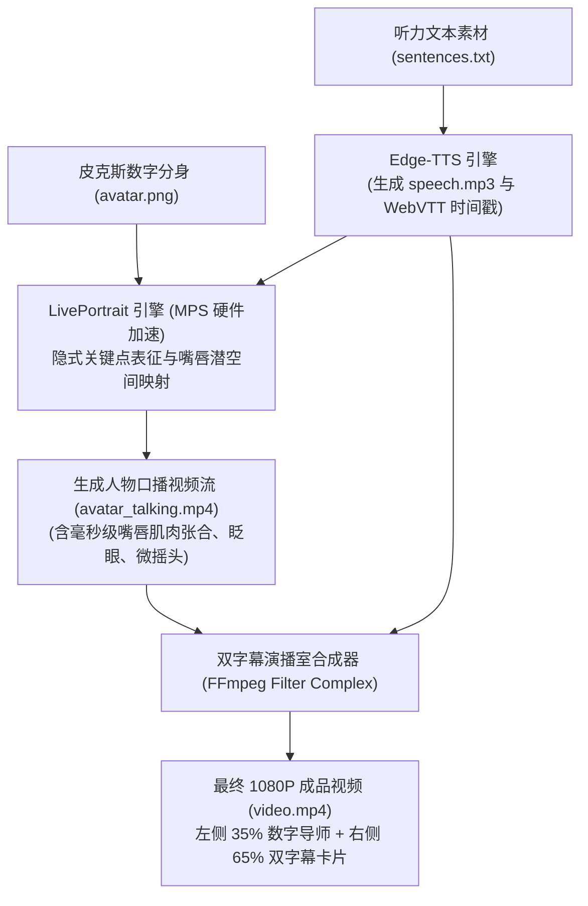

# 方案 B 技术方案：基于 LivePortrait 的 M4 Mac 本地数字人口播系统架构

本文档记录在 Apple Silicon (M4 / 16GB 统一内存) 上，通过 **LivePortrait** 实现“单张皮克斯 3D 肖像 + Edge-TTS 英文音频 ➔ 逼真口型/眼神/微动态口播视频”的技术实现方案，作为 `dual-subtitle-video` 的高阶画质扩展。

---

## 一、 系统架构与流程设计 (End-to-End Pipeline)



---

## 二、 M4 MacBook Air 硬件适配与性能基准

### 1. 硬件规格适配
- **计算核心**：Apple M4（10 核 CPU / 10 核 GPU / 16 核 Neural Engine）。
- **内存架构**：16 GB 统一内存（Unified Memory），带宽 ~120 GB/s。
- **显存分配**：LivePortrait 推理峰值占用显存约 **3.2 GB ~ 4.0 GB**，在 16GB 统一内存上运行绰绰有余。
- **存储需求**：模型权重及 Python 依赖环境约占用 **3.5 GB** 磁盘空间。

### 2. 预期推理速度
- **非扩散架构优势**：LivePortrait 采用隐式面部特征点与局部仿射流场，无需 Diffusion 多步去噪。
- **推理帧率**：在 M4 MPS (Metal) 加速下，平均推理速度可达 **12 ~ 20 FPS**。
- **耗时预估**：一段 2 分钟的听力口播视频（如 30 句对话），本地渲染通常仅需 **3 ~ 5 分钟**。

---

## 三、 本地部署与环境搭建步骤 (macOS Apple Silicon)

### 1. 克隆代码仓库
```bash
git clone https://github.com/KwaiVGI/LivePortrait.git
cd LivePortrait
```

### 2. 创建独立 Python 虚拟环境
```bash
python3 -m venv .venv
source .venv/bin/activate
pip install --upgrade pip
```

### 3. 安装针对 Apple Silicon 优化的 PyTorch 与依赖
```bash
# 安装支持 MPS (Metal) 的 PyTorch
pip install torch torchvision torchaudio

# 安装 LivePortrait 基础依赖
pip install -r requirements.txt
pip install onnxruntime-silicon opencv-python-headless pyyaml rich
```

### 4. 下载预训练模型权重 (HuggingFace)
```bash
# 使用 huggingface-cli 下载权重到 pretrained_weights 目录
pip install huggingface_hub
huggingface-cli download KwaiVGI/LivePortrait --local-dir pretrained_weights
```

---

## 四、 命令行单步推理与调用范例

### 1. 使用单张图片 + 英文语音生成口播视频
```bash
python inference.py \
  --source path/to/avatar_geek_studio.png \
  --driving_audio path/to/speech.mp3 \
  --output_dir output/ \
  --device mps \
  --flag_do_crop True
```

### 2. 参数调优推荐
- `--flag_lip_zero True`：在静音段强制将嘴唇回归完全闭合状态，防止停顿间隙微张。
- `--flag_eye_retargeting True`：启用自然的周期性眨眼模拟。
- `--flag_stitching True`：将生成的运动面部无缝缝合回原始背景图中，确保发丝与机房背景边缘不模糊。

---

## 五、 与 `dual_sub_video.py` 的无缝拼合代码逻辑

在 `src/blogger/core/dual_sub_video.py` 中，通过 FFmpeg 的 `filter_complex` 将左侧生成的人物视频与右侧字幕卡片进行动态拼合：

```bash
ffmpeg -y \
  -i avatar_talking.mp4 \
  -i right_subtitle_frames.mp4 \
  -filter_complex "[0:v]scale=640:870[avatar]; [1:v][avatar]overlay=80:130[outv]" \
  -map "[outv]" -map 0:a \
  -c:v libx264 -preset veryfast -pix_fmt yuv420p output.mp4
```

---

## 六、 MacBook Air (无风扇) 散热与温控优化建议

1. **短视频批量生产策略**：
   - 保持每集听力视频在 **1 ~ 3 分钟**（15 ~ 35 句话）最佳。M4 芯片在短暂升温期间即可跑完全片，无需担心过热。
2. **长时间渲染注意**：
   - 如果连续批量生成多集，建议垫起笔记本底部增加空气对流，防止长时间满载触发降频。
3. **备用云端降级链路**：
   - 若机器被其他重载任务占用，可在代码中保留 Replicate / SiliconFlow 等云端 Serverless API 接口作为一键切换选项。
