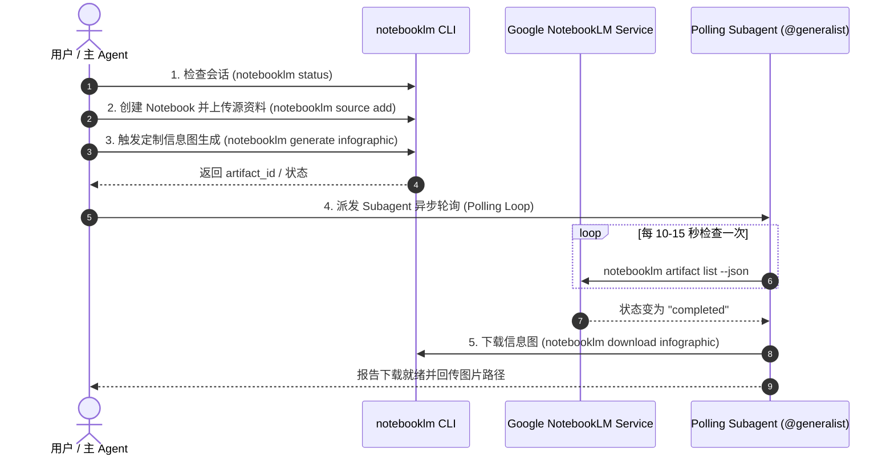

# Generate Infographic Skill (Google NotebookLM)

## Overview

基于 Google NotebookLM 与 `notebooklm-py`，将任意输入（Markdown 文章、本地文档、研报、URL 或研究主题）转化为**高信息密度、高美学质感、语义高度融合的定制信息图（Customize Infographic）**。

支持 **Bento Grid（便当网格）**、**Editorial（杂志社论）**、**Professional（专业商务）**、**Instructional（步骤指南）** 等 11 款精选视觉风格，支持竖版长图（`portrait`）、横版（`landscape`）及方图（`square`），完美适配微信公众号正文、小红书图文卡片、视频封面及深度技术报告。

---

## 视觉风格与场景选型矩阵

| 风格代码 (`--style`) | 视觉特征 | 最佳适用场景 | 推荐版式 (`--orientation`) |
|---|---|---|---|
| **`bento-grid`** | 模块化便当卡片、高信息密度、层级分明 | 复杂系统架构总览、多维度特性矩阵、全景技术选型 | `portrait` (竖版) / `landscape` |
| **`editorial`** | 现代杂志社论扁平风、高审美、大字标题冲击 | 商业认知洞察、高管摘要、方法论模型、思考反思 | `portrait` / `landscape` |
| **`professional`** | 商务专业、严谨规范、报告级配色 | 生产级系统方案、技术评估、企业级实施总结 | `portrait` |
| **`instructional`** | 步骤清晰、动线明确、引导指示符 | 操作指南、迁移 SOP、避坑指南、排错步骤 | `portrait` (垂直纵向流) |
| **`scientific`** | 学术严谨、拓扑关联、公式与数据突出 | 算法原理、量化模型、基准测试基差分析 | `landscape` / `portrait` |
| **`sketch-note`** | 手绘笔记风、生动亲切、右脑记忆 | 新人入门教程、核心概念科普、学习笔记 | `portrait` |
| **`clay`** | 3D 黏土微缩模型、质感突出 | 概念隐喻、爆款社媒封面、趣味技术科普 | `square` / `landscape` |
| **`bricks`** | 像素积木风 | 底层组件构建、模块拼接隐喻 | `landscape` |

---

## 📱 移动端与图文版式铁律 (Mobile Portrait Standard)

> [!IMPORTANT]
> **图文配图必须强制使用 Portrait（竖版）**：
> 1. **移动端阅读优先**：面向微信公众号正文、小红书图文卡片以及手机阅读的所有信息图，**默认必须使用 `--orientation portrait`**。
> 2. **字号与可读性保障**：手机屏幕宽度通常在 375px~430px，竖版长图（3:4 或高长比）在撑满屏宽时，文字映射到视网膜上的有效字号最大，视线向下流转最自然。
> 3. **横版限制**：`--orientation landscape`（横版）**仅用于 16:9 宽屏视频封面或桌面端宽屏演示**，严禁直接插入到移动端图文正文中（会导致等比缩放到极小，字号过小无法辨识）。

---



---

### 1. 认证与会话检查 (Authentication)

在执行任何生成操作前，必须确认 NotebookLM 会话有效：

```bash
uv run notebooklm status
```

- **正常状态**：输出当前绑定的 Notebook ID 与 Conversation ID。
- **过期或未登录**：若返回 `Authentication expired or invalid`，提示用户在终端运行一次登录：
  ```bash
  uv run notebooklm login --browser chrome --browser-cookies chrome
  ```

---

### 2. 知识库准备与来源摄取 (Source Ingestion)

#### 方式 A：基于现有 Markdown 文章或本地文档
```bash
# 1. 创建专题 Notebook
uv run notebooklm create "Infographic: [Topic Title]" --json

# 2. 添加本地 Markdown 或 PDF 作为资料源
uv run notebooklm source add "./articles/YYYY-MM-DD-slug/article.md" --json

# 3. 等待数据源解析索引完成 (可选/推荐)
uv run notebooklm source wait <source_id> -n <notebook_id>
```

#### 方式 B：基于在线 URL 或研究主题
```bash
uv run notebooklm create "Research: [Topic]" --json
uv run notebooklm source add "https://example.com/tech-article" --json
```

---

### 3. 参数化触发生成 (Customize Infographic Generation)

执行生成命令时，必须结合文章核心诉求提供结构化的 **定制提示词 (Customize Prompt)**：

```bash
uv run notebooklm generate infographic \
  --style bento-grid \
  --orientation portrait \
  --detail detailed \
  --language zh_Hans \
  -n <notebook_id> \
  "【核心主题】T-A-O 认知协作架构在技术写作中的落地
   【核心模块】
   1. 顶部 Header：认知倒置警示（为什么纯人工或纯AI都会失败）
   2. 核心架构 3 栏：人类 Context Framing -> AI Draft 编译 -> Checklist 质量终审
   3. 核心指标对比：完读率提升 50%，CTR 达 8%
   4. 底部 Takeaway：3 个防踩坑铁律" \
  --json
```

#### 常用参数速查
- `--style [bento-grid|editorial|professional|instructional|scientific|sketch-note|clay|anime|kawaii|bricks|auto]`：视觉风格（默认 `auto`，技术文推荐 `bento-grid` 或 `editorial`）。
- `--orientation [portrait|landscape|square]`：方向（手机端/公众号长图推荐 `portrait`，封面推荐 `landscape`）。
- `--detail [concise|standard|detailed]`：信息详尽度（深度长文推荐 `detailed`）。
- `--language [zh_Hans|en]`：语言。
- `--prompt-file <path>`：当提示词极长时，支持从文件读取定制 Prompt。

---

### 4. 异步轮询与下载 (Subagent Polling & Download)

> [!TIP]
> 信息图生成通常耗时 **30 ~ 90 秒**。为主 Agent 保持响应能力，应派发一个 lightweight Subagent（`@self` 或 `@generalist`）执行轮询与下载。

#### Subagent 派发模板
```text
Task: Poll and download NotebookLM Infographic artifact.
Notebook ID: {notebook_id}
Output Path: ./articles/{slug}/infographic_bento.png

SOP:
1. 每隔 10 秒运行一次：`uv run notebooklm artifact list -n {notebook_id} --json`
2. 检查对应 artifact_id（或最新生成的 infographic artifact）的 status 是否为 "completed"。
3. 一旦完成，执行下载：
   `uv run notebooklm download infographic ./articles/{slug}/infographic_bento.png --latest -n {notebook_id}`
4. 若失败或超时（超过 300 秒），记录错误原因并退出。
```

---

---

### 5. 图片消息与文章嵌入 (Embedding into Photo Message / Articles)

下载完成后，将生成的信息图优雅地集成到目标产物中：

1. **用于 `generate-photo-message`（微信图片消息 / 小绿书 Deck）**：
   - 作为小绿书卡片画册的核心深度卡片（如 `02_infographic.png`）。
   - 在 `article.md` 的 `photos` 列表中直接挂载：
     ```yaml
     photos:
       - "01_cover.png"
       - "02_infographic.png"  # NotebookLM 3:4 竖版便当网格知识卡片
       - "03_vs_comparison.png"
       - "04_bullet_points.png"
       - "05_summary_cta.png"
     ```
2. **用于长文 Markdown 正文嵌入**：
   ```markdown
   
   ```
3. **用于视频或公众号封面**：若生成的是 `--orientation landscape` 封面，可配合 `python tools/fit_wechat_cover.py` 进行标准比例 Letterbox 处理。

---

## 🔗 与 generate-photo-message 技能的联动模式

`generate-infographic` 是 **`generate-photo-message`（小绿书图文卡片）的核心上游引擎**。

在小绿书/微信图片消息的 3~7 张卡片规划中，二者的分工与联动为：
- **`01_cover.png`**：由 `generate_image` 或 SVG 生成 4~8 字强冲击爆破封面；
- **`02_infographic.png`**：**由本技能（`generate-infographic`）生成 3:4 竖版 Bento-grid / Editorial 高密全景卡片**，承载 80% 的系统架构与知识干货；
- **`03 ~ 06 卡片`**：由 `generate_photo_cards.py` 生成二元对抗（VS）、步骤流转（Pipeline）与复盘 CTA 卡片。

---

## 定制提示词工程模板 (Infographic Prompt Engineering)

为确保生成的信息图具备顶尖的视觉层次与信息密度，编写定制提示词时建议包含以下 4 要素：

```text
【视觉定位】[风格描述，例如：现代杂志社论风格，清爽高对比度配色]
【核心主张】[一句话认知钩子，例如：Harness 正在吞噬框架，模型原生能力重构基础设施]
【结构布局】
  - 模块 1（顶层痛点）：[描述...]
  - 模块 2（核心拓扑/机制）：[3~4个关键节点...]
  - 模块 3（决策对比矩阵）：[对比 A vs B...]
  - 模块 4（落地准则/Takeaway）：[2~3条金句规则...]
【受众与语调】[面向资深技术专家/架构师，严谨、锐利、数据驱动，中文呈现]
```

---

## 常用命令速查表 (Quick Reference)

| 操作 | 命令 |
|---|---|
| 登录 / 认证 | `uv run notebooklm login --browser chrome --browser-cookies chrome` |
| 状态检查 | `uv run notebooklm status` |
| 创建笔记本 | `uv run notebooklm create "Title" --json` |
| 挂载资料源 | `uv run notebooklm source add "./article.md" --json` |
| 生成便当网格信息图 | `uv run notebooklm generate infographic --style bento-grid --orientation portrait --detail detailed "Prompt" --json` |
| 生成杂志社论信息图 | `uv run notebooklm generate infographic --style editorial --orientation landscape "Prompt" --json` |
| 轮询生成工件 | `uv run notebooklm artifact list -n <notebook_id> --json` |
| 下载最新信息图 | `uv run notebooklm download infographic ./output.png --latest -n <notebook_id>` |
